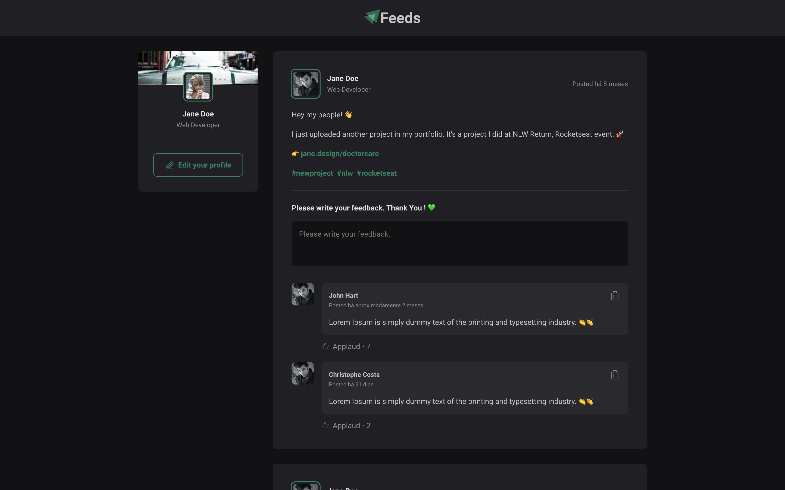

   

  
  
  

## Sobre o desafio 🚀

Projeto desenvolvido durante a formação [Reactjs da Trilha Ignite - Rocketseat](https://lp.rocketseat.com.br/ignite-rocketseat-2).

Conceitos abordados:

- Estados
- Imutabilidade do estado
- Listas e chaves no ReactJS
- Propriedades
- Componentização

---

Created with 💜 by <a href="https://www.linkedin.com/in/eduardoqueiros/">Eduardo Queirós</a> :wave:
